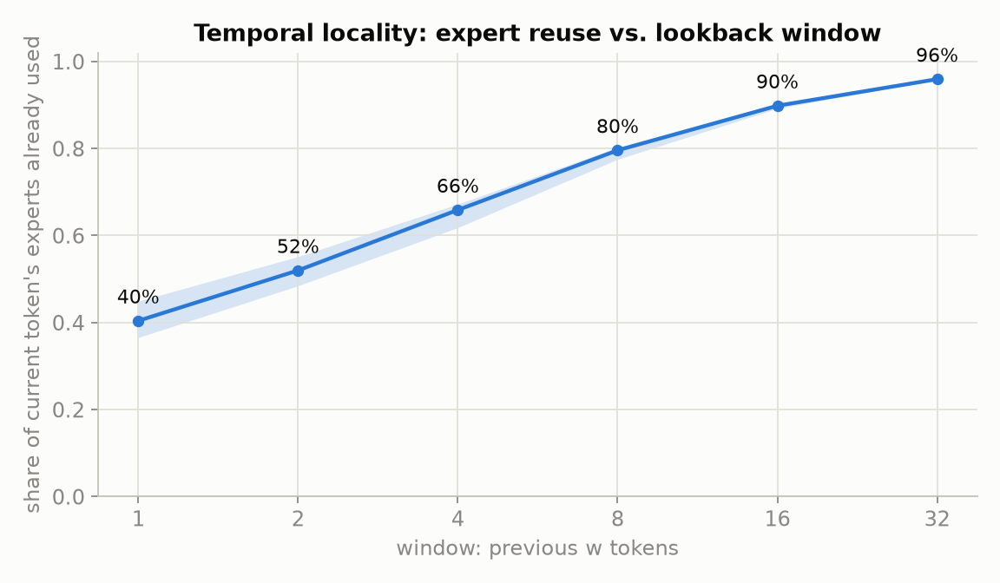
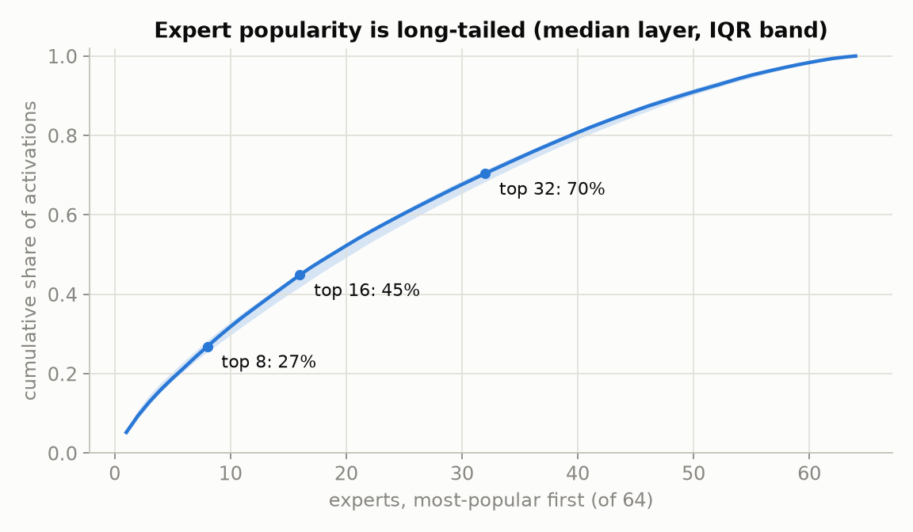
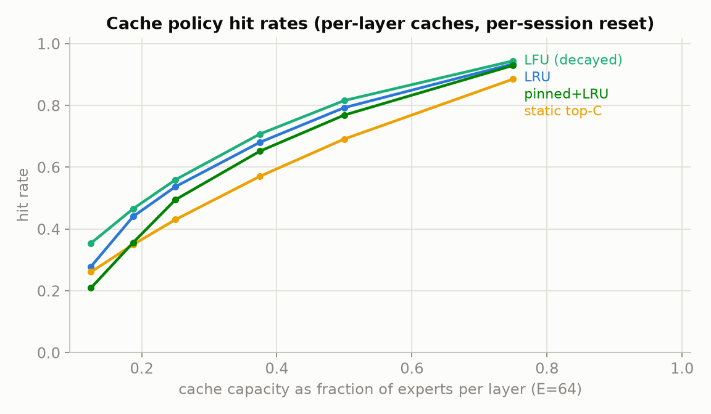
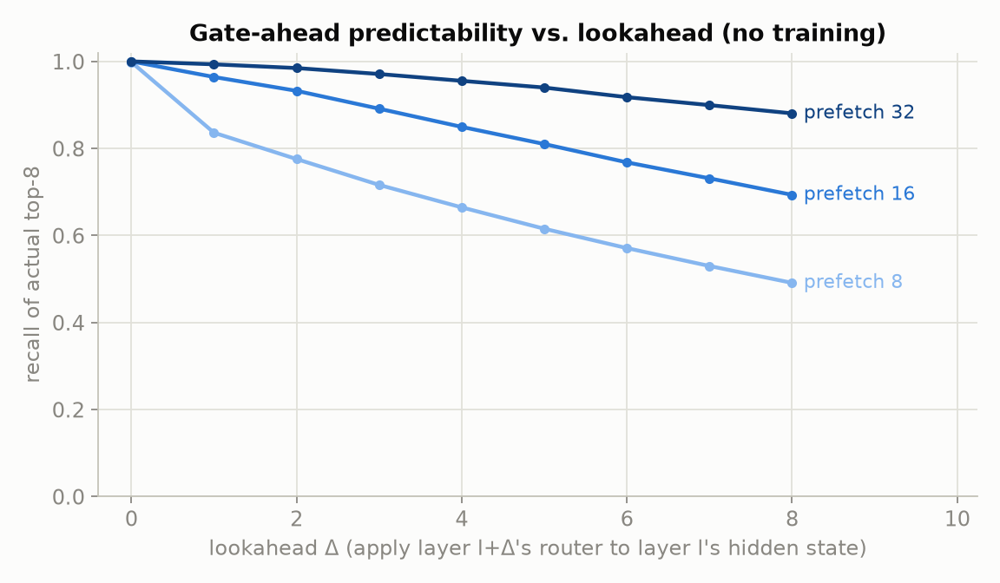
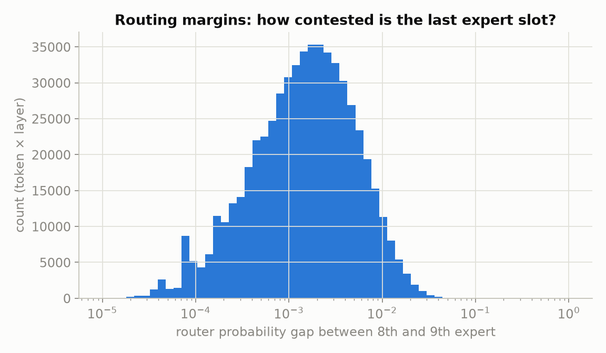
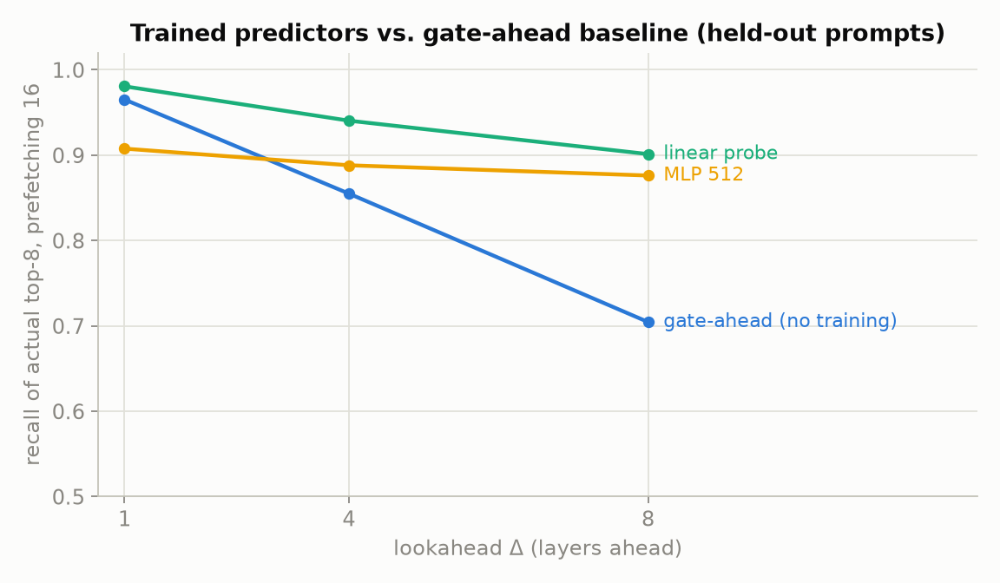

# Trace Analysis: Expert Routing Locality & Predictability

*Phase 1 results, 2026-07-12. Raw numbers in `bench/results/olmoe-analysis.json`.*

## Setup

- **Model**: OLMoE-1B-7B-Instruct — 16 layers × 64 experts, top-8, softmax router.
  (Small enough to trace with full hidden states in PyTorch on CPU; Qwen3-30B-A3B
  traces — 48 × 128, top-8, llama.cpp — are being collected for scale confirmation.)
- **Corpus**: 60 prompts × 6 domains (code, math, chat, essay, reasoning, structured),
  ≤1024 sampled decode tokens each (temp 0.7) → **37,128 decode tokens**, plus prefill.
- Per token × layer we record router logits (all 64) and the router's input hidden
  state, so every analysis below is exact, not sampled.

## Findings

### 1. Temporal locality is strong — the core premise holds



**40%** of a token's 8 experts were used by the immediately previous token; **80%**
appear within the previous 8 tokens; **96%** within 32 (median layer, IQR band tight).
A cache that merely keeps "recently used experts" resident captures most traffic —
this is the single most load-bearing empirical fact for the whole design.

### 2. Popularity skew alone is NOT enough



The most popular half of experts covers only ~70% of activations (median layer;
OLMoE is load-balanced by training). A **static** hot set is a weak cache on its own —
dynamic recency/frequency does the real work (see next) — but it still matters as the
*placement* prior for what should live in RAM vs SSD at cold start.

### 3. Cache policy: decayed-LFU > LRU > static; capacity is the lever



| capacity (frac of experts) | 12.5% | 25% | 37.5% | 50% | 75% |
|---|---|---|---|---|---|
| LRU | .28 | .54 | .68 | .79 | .93 |
| **LFU (0.98 decay/token)** | **.35** | **.56** | **.71** | **.82** | **.94** |
| static top-C | .26 | .43 | .57 | .69 | .89 |

Decayed-LFU (an LCP-style policy) wins at every size, consistent with the literature.
Per-layer caches, reset per prompt (conservative — a long-running server does better).

### 4. Gate-ahead prediction: high recall with ZERO training



Applying layer *l+Δ*'s (real) router to layer *l*'s hidden state and prefetching the
top-m:

| lookahead Δ | m=8 | m=16 | m=32 |
|---|---|---|---|
| 1 | .84 | **.96** | .99 |
| 4 | .66 | .85 | **.96** |
| 8 | .49 | .69 | **.88** |

Hidden states drift slowly across layers, so the router itself is a free predictor.
2× overprovisioning (m=16) buys ~12pp of recall at Δ=1; 4× keeps 88% recall even a
full 8 layers ahead. **This is the floor a trained predictor must beat** — and it
already clears the bar the paging design needs for RAM→compute prefetch. The long-
horizon (SSD→RAM) predictor is the part where training should pay.

### 5. Router margins are razor-thin — substitution is cheap, prediction is hard at the boundary



The probability gap between the 8th and 9th expert is < 0.01 in **95.5%** of
(token, layer) events (median 0.0015). Two consequences:

- The last cache slots are inherently hard to predict (near-coin-flips) — chasing
  100% recall is the wrong goal; overprovision + demand-fallback instead.
- Swapping a marginal expert for its runner-up should cost little quality
  (HOBBIT/ ReMoE-style fallbacks look viable — to be verified in Phase 2 with
  perplexity measurements).

### 6. Trained predictors beat gate-ahead — and the gap grows with lookahead



Per-layer predictors trained on the traces (KL-distilled from the true router
distribution; 80/20 prompt-level split; `scripts/train_predictor.py`):

| recall@16 of actual top-8 | Δ=1 | Δ=4 | Δ=8 |
|---|---|---|---|
| gate-ahead (no training) | .965 | .855 | .704 |
| **linear probe (warm-started, 2048→64)** | **.981** | **.940** | **.901** |
| MLP 2048→512→64 (cold start) | .908 | .888 | .876 |

The linear probe — literally the same shape as the router, warm-started from the
gate-ahead solution — dominates at every horizon, and its advantage *widens* with Δ
(+20 pp at Δ=8). Long-horizon prediction is learnable, which is precisely what the
SSD tier needs: at Δ=8 with 2× overprovision, 90% of the experts a layer will need
can be in flight 8 layers early. (The cold-start MLP shows the failure mode too:
without the warm start it stays below the probe — initialization from the router is
the trick. First training attempt with BCE-on-soft-probs underfit catastrophically;
KL distillation is the right loss.)

## Implications for the runtime design

1. Cache = decayed-LFU over experts, sized as large as RAM allows; static popularity
   only decides SSD layout and cold-start placement.
2. Prefetch = warm-started linear probes: Δ=1–2/m=16 for the near tier, Δ=8/m=16–32
   for the SSD tier (90%+ recall measured); probes cost one extra router-sized matmul
   per layer — negligible. Cross-token horizons remain to be studied (Phase 3).
3. Misses concentrate in low-margin routing events → substitution fallback is
   promising; measure its quality cost early.
4. OLMoE caveat: 64 experts/layer is 4× denser than GLM-5.2's 256; per-layer sparsity
   patterns may differ at scale. Qwen3-30B (128 experts) traces will interpolate, and
   GLM-4.5-Air (same family as target) confirms.

## Reproduce

```
scripts/trace_olmoe.py --domains all --max-new 1024   # ~90 min, 2 workers
scripts/analyze_olmoe.py                              # charts + JSON
scripts/trace_qwen.sh                                 # llama.cpp expert-ID traces
scripts/sim_paging.py --traces traces/olmoe ...       # what-if throughput model
```
